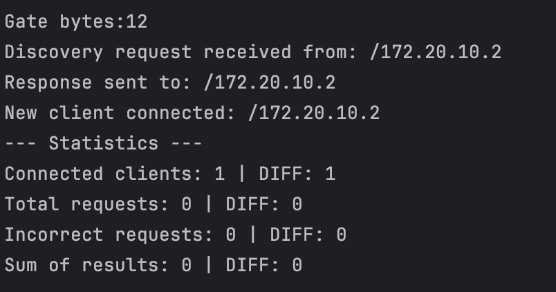

# Centralized Computing System (CCS) 📡

## Overview
This project implements a **Centralized Computing Server (CCS)** that provides **service discovery via UDP** and **client handling via TCP**. The system supports **arithmetic operations** requested by clients over the network.

### **The CCS Server:**
- 📡 Listens for client **discovery requests over UDP**.
- 🔗 Accepts client **connections over TCP**.
- 🧮 Processes **arithmetic operations** (addition, subtraction, multiplication, division).
- 📊 Maintains **server statistics** on client connections and request handling.

---

## Features ⚡

### **Server**
- 📡 **Service Discovery**: Clients can locate the server dynamically via **UDP broadcast**.
- 🔗 **Multi-Client Support**: Manages multiple client connections simultaneously over **TCP**.
- 🧮 **Arithmetic Operations**:
    - `ADD <num1> <num2>` ➝ Adds two numbers.
    - `SUB <num1> <num2>` ➝ Subtracts the second number from the first.
    - `MUL <num1> <num2>` ➝ Multiplies two numbers.
    - `DIV <num1> <num2>` ➝ Divides the first number by the second (checks for division by zero).
- 📊 **Server Statistics**:
    - Tracks total clients connected.
    - Monitors request and error counts.
    - Logs request results.
- 🧵 **Multi-threading**:
    - Uses **thread pools** for efficient request processing.
    - Scheduled tasks for periodic **server statistics**.

### **Client**
- 📡 **Discovers CCS server** automatically via **UDP**.
- 🔗 **Connects via TCP** for communication.
- 📝 **Interactive Command-Line Interface**:
    - Users enter operations in the format: `<operation> <num1> <num2>`.
    - Receives and displays results from the server.
- ⏳ **Handles connection timeouts and errors gracefully**.

---

## **Example of Usage**
1. Starting a server with a "port"
2. Starting a client with the same "port"

3. See Server output below:

---

## **Built with**
* JAVA
* SDK - openjdk-18
---
## License
This project is licensed under the MIT License
